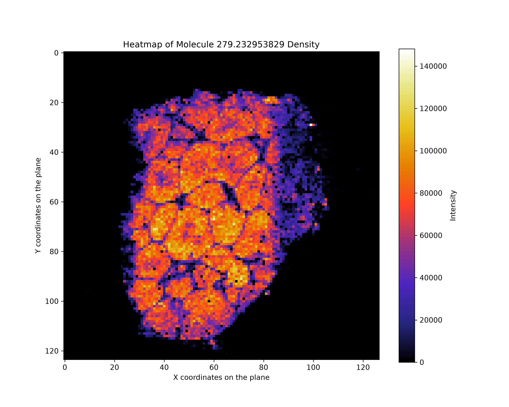
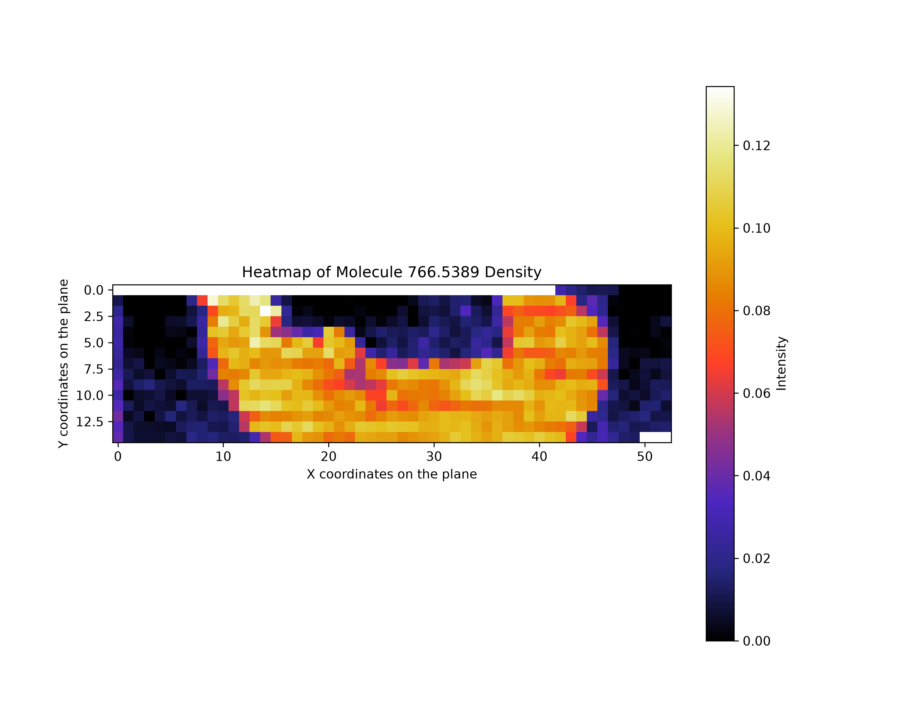

# Mass Spectrometry Imaging Visualization

A Python workflow for cleaning, processing, normalizing, and visualizing mass spectrometry imaging (MSI) data as spatial molecular-intensity heatmaps.

The project supports two example MSI export structures, converts them into analysis-ready tables with spatial coordinates, optionally applies Total Ion Current (TIC) normalization, and saves high-resolution heatmaps for selected m/z features.

## Table of Contents

1. [Overview](#overview)
2. [Features](#features)
3. [Workflow](#workflow)
4. [Repository Structure](#repository-structure)
5. [Supported Input Formats](#supported-input-formats)
6. [Expected Processed Data Format](#expected-processed-data-format)
7. [Installation](#installation)
8. [Configuration](#configuration)
9. [Usage](#usage)
10. [Main Components](#main-components)
11. [Output Files](#output-files)
12. [Troubleshooting](#troubleshooting)
13. [Limitations](#limitations)
14. [Technologies](#technologies)
15. [License](#license)
16. [Author](#author)

## Overview

Mass spectrometry imaging datasets combine molecular-intensity measurements with spatial coordinates. Each measurement point contains intensity values for many m/z features, allowing the spatial distribution of selected molecules to be displayed across a sample.

This repository provides a reusable workflow for:

1. Reading raw MSI export files.
2. Cleaning and restructuring different input formats.
3. Saving processed datasets under a dedicated directory.
4. Loading processed data into a pandas DataFrame.
5. Selecting an m/z feature for visualization.
6. Optionally normalizing molecular intensities by TIC.
7. Creating and saving spatial heatmaps.

The current runner demonstrates the workflow with two example datasets.

## Features

- Supports two different raw MSI export layouts.
- Separates raw and processed data.
- Automatically creates required project directories.
- Extracts spatial `X` and `Y` coordinates.
- Handles m/z intensity columns.
- Supports Total Ion Current normalization.
- Can normalize either all m/z features or one selected feature.
- Generates spatial molecular-intensity heatmaps.
- Saves figures with configurable format and resolution.
- Uses a reusable Python package structure.
- Provides centralized path and figure configuration.

## Workflow

```text
Raw MSI data
     │
     ▼
Format-specific cleaning
     │
     ▼
Processed table with X, Y and m/z columns
     │
     ▼
Load into pandas DataFrame
     │
     ├── Optional TIC normalization
     │
     ▼
Select an m/z feature
     │
     ▼
Pivot values into a spatial matrix
     │
     ▼
Generate and save a heatmap
```

## Repository Structure

```text
Mass-Spectrometry-Imaging-script/
│
├── README.md
├── requirements.txt
├── config.py
├── run_visualization.py
├── .gitignore
│
├── data/
│   ├── raw/
│   │   ├── 20191017_liver_4v_75um_Analyte_1AFAMM_1_pixel_intensities.csv
│   │   └── Sample_PL.txt
│   │
│   └── processed/
│       ├── processed_20191017_liver_4v_75um_Analyte_1AFAMM_1_pixel_intensities.csv
│       └── processed_Sample_PL.txt
│
├── figures/
│   └── generated heatmaps
│
└── msi_visualization/
    ├── __init__.py
    ├── processing.py
    └── visualization.py
```

### Root files

| File | Purpose |
|---|---|
| `run_visualization.py` | Runs the example preprocessing and visualization workflows |
| `config.py` | Defines project directories and figure settings |
| `requirements.txt` | Lists the Python dependencies |
| `.gitignore` | Excludes generated or environment-specific files |

### Package files

| File | Purpose |
|---|---|
| `msi_visualization/processing.py` | Loads, cleans, restructures and normalizes MSI data |
| `msi_visualization/visualization.py` | Creates and saves spatial heatmaps |
| `msi_visualization/__init__.py` | Marks the directory as a Python package |

## Supported Input Formats

The preprocessing methods can be skipped when the dataset is already arranged as a table containing spatial coordinates and m/z intensity columns.

### Format 1: Transposed MSI Feature Table

The first preprocessing method is designed for a CSV export in which:

- the first two rows are skipped;
- molecular metadata columns are removed;
- the table is transposed;
- the `mz` row becomes the feature header;
- spatial coordinates are extracted from the original index strings.

The following metadata columns are removed:

```text
mol_formula
adduct
moleculeNames
moleculeIds
```

The corresponding method is:

```python
clean_transposed_msi_feature_table(processed_data_dir, sample_file_name)
```

### Format 2: Tab-Separated MSI Export

The second preprocessing method is designed for a tab-separated text export in which:

- the fourth line contains the molecular column names;
- data records begin on the fifth line;
- the file contains index and spatial-coordinate information;
- the remaining columns contain molecular intensities.

The corresponding method is:

```python
clean_tab_separated_msi_export(processed_data_dir, sample_file_name)
```

## Expected Processed Data Format

After cleaning, the data should contain spatial coordinates and numerical m/z features in a structure similar to:

```text
X    Y    123.456    255.233    766.5389    ...
0    0    0.90       0.30       0.10        ...
0    1    0.30       0.40       0.08        ...
1    0    0.72       0.25       0.14        ...
...  ...  ...        ...        ...         ...
```

Where:

- each row represents one spatial measurement point;
- `X` and `Y` define the position of that point;
- each m/z column stores the measured intensity for one molecular feature.

## Installation

Clone the repository:

```bash
git clone https://github.com/LittleBigPluton/Mass-Spectrometry-Imaging-script.git
cd Mass-Spectrometry-Imaging-script
```

Create a virtual environment:

```bash
python3 -m venv venv_msi_imaging/
```

Activate it on Linux or macOS:

```bash
source venv_msi_imaging/bin/activate
```

Activate it on Windows PowerShell:

```powershell
venv_msi_imaging\Scripts\Activate.ps1
```

Install the dependencies:

```bash
python3 -m pip3 install --upgrade pip
python3 -m pip3 install -r requirements.txt
```

## Configuration

Project paths and default figure settings are defined in `config.py`.

```python
from pathlib import Path

root_directory = Path(__file__).resolve().parent

data_dir = root_directory / "data"
raw_data_dir = data_dir / "raw"
processed_data_dir = data_dir / "processed"

figures_dir = root_directory / "figures"

data_dir.mkdir(parents=True, exist_ok=True)
raw_data_dir.mkdir(parents=True, exist_ok=True)
processed_data_dir.mkdir(parents=True, exist_ok=True)
figures_dir.mkdir(parents=True, exist_ok=True)

figure_format = "png"
dpi_resolution = 300
heat_map_size = (10, 8)
```

The required directories are created automatically when `config.py` is imported.

### Figure settings

| Setting | Default | Description |
|---|---:|---|
| `figure_format` | `"png"` | Output format for saved heatmaps |
| `dpi_resolution` | `300` | Resolution of saved figures |
| `heat_map_size` | `(10, 8)` | Default Matplotlib figure size |

## Usage

Place raw datasets inside:

```text
data/raw/
```

Then run the main workflow from the repository root.

### Running the Complete Example Workflow

```bash
python3 run_visualization.py
```

The current runner:

1. processes the transposed CSV example;
2. creates a heatmap for m/z `279.232953829`;
3. processes the tab-separated text example;
4. applies TIC normalization;
5. creates a heatmap for m/z `766.5389`;
6. saves processed data and figures in their configured directories.

### Visualizing a Single Dataset

A minimal example for the transposed CSV format:

```python
from config import raw_data_dir, processed_data_dir
from msi_visualization.visualization import visualize

sample_file_name = ("20191017_liver_4v_75um_Analyte_1AFAMM_1_pixel_intensities.csv")
molecule_mz = "279.232953829"

raw_file_path = raw_data_dir / sample_file_name

sample = visualize(raw_file_path)
sample.clean_transposed_msi_feature_table(processed_data_dir, sample_file_name)
sample.create_data_frame()
sample.set_molecule(molecule_mz)
sample.plot_heatmap(molecule_mz, show=True, save=True)
```

A minimal example for the tab-separated format:

```python
from config import raw_data_dir, processed_data_dir
from msi_visualization.visualization import visualize

sample_file_name = "Sample_PL.txt"
molecule_mz = "766.5389"

raw_file_path = raw_data_dir / sample_file_name

sample = visualize(raw_file_path)
sample.clean_tab_separated_msi_export(processed_data_dir, sample_file_name)
sample.create_data_frame()
sample.set_molecule(molecule_mz)
sample.normalize_by_TIC(all=True)
sample.plot_heatmap(molecule_mz, TIC=True, show=True, save=True)
```

### Selecting an m/z Feature

The m/z value must match a DataFrame column name.

```python
sample.set_molecule("766.5389")
sample.plot_heatmap("766.5389", show=True)
```

Available columns can be inspected with:

```python
sample.get_column_names()
```

or:

```python
print(sample.mz_values)
```

### Applying TIC Normalization

Total Ion Current is calculated for each spatial point as the sum of its molecular intensities.

Normalize all detected m/z features:

```python
sample.normalize_by_TIC(all=True)
```

Normalize only the selected molecule:

```python
sample.set_molecule("766.5389")
sample.normalize_by_TIC(all=False)
```

After normalization, missing values produced by division are replaced with zero.

## Main Components

### Data Processing

The `data_process` class stores the current file path and DataFrame state.

Important methods include:

| Method | Description |
|---|---|
| `create_data_frame()` | Loads the current processed file into pandas |
| `get_unique_coordinates()` | Extracts unique X and Y coordinates |
| `get_column_names()` | Prints and returns all DataFrame columns |
| `get_DataFrame()` | Returns the current DataFrame |
| `set_molecule()` | Stores the selected m/z feature |
| `clean_data()` | Removes specified columns |
| `normalize_by_TIC()` | Applies TIC normalization |
| `clean_transposed_msi_feature_table()` | Cleans the first supported raw format |
| `clean_tab_separated_msi_export()` | Cleans the second supported raw format |

Both preprocessing methods update the object's `file_path` after saving the processed file. The same object can therefore continue directly with data loading and visualization.

### Visualization

The `visualize` class inherits from `data_process`, so one object can perform preprocessing, normalization, and plotting.

Important methods include:

| Method | Description |
|---|---|
| `plot_heatmap()` | Converts spatial data into a heatmap |
| `save_plot()` | Saves a figure using the configured directory, format, and DPI |

The heatmap is created by pivoting:

```python
pivot_table = self.data.pivot(index="Y", columns="X", values=value)
```

The plot uses the `CMRmap` colormap and nearest-neighbor interpolation.

## Output Files

Processed datasets are saved in:

```text
data/processed/
```

Their names use the `processed_` prefix:

```text
processed_<original-file-name>
```

Generated heatmaps are saved in:

```text
figures/
```

Typical output names are:

```text
processed_20191017_liver_4v_75um_Analyte_1AFAMM_1_pixel_intensities_279.232953829_heatmap.png

processed_Sample_PL_766.5389_heatmap_TIC.png
```

The exact extension and resolution are controlled by `config.py`.




## Troubleshooting

### File not found

Confirm that the raw files are stored under:

```text
data/raw/
```

Also confirm that their names match those defined in `run_visualization.py`.

### Selected m/z value is not defined

The following message means the requested value does not exactly match a DataFrame column:

```text
<value> is not defined in the data set.
```

Inspect the available features:

```python
sample.get_column_names()
```

m/z column names are handled as strings, so preserve their exact decimal representation.

### Duplicate X/Y coordinate pairs

`DataFrame.pivot()` requires each `(X, Y)` coordinate pair to be unique. Duplicate coordinate pairs may produce:

```text
ValueError: Index contains duplicate entries, cannot reshape
```

Inspect duplicates before plotting:

```python
duplicates = sample.data.duplicated(subset=["X", "Y"], keep=False)

print(sample.data.loc[duplicates, ["X", "Y"]])
```

If duplicates are valid, an aggregation rule must be selected before creating the heatmap.

### Matplotlib cannot display the figure

In a non-interactive environment, `plt.show()` may produce a backend warning. You can still save the figure with:

```python
sample.plot_heatmap(molecule_mz, show=False, save=True)
```

On Ubuntu or Debian, interactive Tk windows may require:

```bash
sudo apt install python3-tk
```

### Figure is not saved where expected

The output directory is defined in `config.py`:

```python
figures_dir = root_directory / "figures"
```

The directory is created automatically when the configuration module is imported.

### Division by zero during TIC normalization

Spatial points with zero total intensity can produce missing values during division. The current implementation replaces resulting missing values with zero.

## Limitations

- The preprocessing functions are tailored to the two included example export structures.
- m/z feature selection requires an exact column-name match.
- Heatmap creation assumes unique X/Y coordinate pairs.
- The current runner contains dataset-specific names and selected m/z values.
- Input validation and automated tests are not yet included.
- The code currently focuses on static Matplotlib heatmaps rather than interactive visualization.
- Very large MSI datasets may require memory and performance optimization.

## Technologies

- Python
- pandas
- NumPy
- Matplotlib
- pathlib

## License

This project is licensed under the MIT License.

## Author

Developed by [LittleBigPluton](https://github.com/LittleBigPluton).
